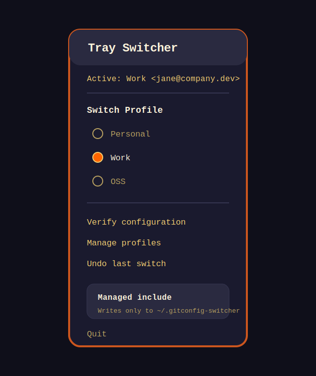

<div align="center">

# Git Profile Switcher

**Manage multiple Git identities from your system tray without taking ownership of your Git config.**

Switch between Git profiles — name, email, SSH keys, and GPG signing — with a managed include file instead of rewriting `~/.gitconfig`. Works with GitHub, GitLab, Bitbucket, Codeberg, and any Git hosting platform.

[](./LICENSE)
[](https://github.com/Kinau-Guatemala/git-profile-switcher/actions/workflows/ci.yml)
[](https://github.com/Kinau-Guatemala/git-profile-switcher/releases)
[](#installation)
[](#architecture)

</div>

---

## Screenshots

<p align="center">
  
</p>

<p align="center">
  
</p>

---

## Why This Exists

Developers who work across personal projects, open-source contributions, and employer repositories on the same machine constantly fight with Git identity:

- Commits land under the wrong name or email.
- SSH permission errors happen because the wrong account answers first.
- Switching context means remembering a pile of `git config --global ...` commands.
- `~/.ssh/config` turns into an unmaintainable set of aliases and comments.

Git Profile Switcher turns that into a tray-first workflow with undo, verification, and a managed include file that does not take over your existing config.

## Features

| Feature | Description |
|---------|-------------|
| **Tray-first switching** | Switch profiles from the system tray without keeping the main window open. |
| **Managed include strategy** | Writes only to `~/.git-profile-switcher`, not your full `~/.gitconfig`. |
| **SSH key management** | Generate ed25519 keys, add host aliases, and test connections from the app. |
| **Optional passphrase support** | Leave passphrases blank for convenience, or set one when you want the private key encrypted. |
| **Config verification** | See the effective Git identity and which file set every value. |
| **Undo support** | Revert the last profile switch from the tray. |
| **Platform-agnostic detection** | Detect aliases for GitHub, GitLab, Bitbucket, Codeberg, Azure DevOps, and more. |
| **Auto-import** | Import existing profiles from your Git config or SSH config. |
| **Per-profile signing** | Store GPG signing settings alongside the profile. |
| **Retro themes** | Five built-in palettes: Lava, Matrix, Synthwave, Glacier, and Amber. |

---

## Installation

### Prebuilt Downloads

When a GitHub Release is published, download the latest asset that matches your platform from [Releases](https://github.com/Kinau-Guatemala/git-profile-switcher/releases):

- Windows: portable `.exe`
- Linux: `.AppImage`
- macOS: `.dmg`

Release packaging is automated. Pushing a `v*` tag runs `.github/workflows/release.yml`, builds the three platform artifacts, and attaches them to a GitHub Release with generated notes.

### Prerequisites

- [Git](https://git-scm.com/) installed and available in `PATH`
- [Node.js](https://nodejs.org/) 18+ if you are running from source

### From Source

```bash
git clone https://github.com/Kinau-Guatemala/git-profile-switcher.git
cd git-profile-switcher

npm ci
npm run dev
```

### Build Packages Locally

```bash
# Windows portable .exe
npm run build

# Linux AppImage
npm run build:appimage

# macOS dmg
npm run build:mac

# Arch Linux pacman package
npm run build:arch
```

Packaged artifacts are written to `dist/`.

---

## How It Works

Git Profile Switcher uses a managed include strategy that is safe and non-destructive:

```text
~/.gitconfig                          ~/.git-profile-switcher
┌──────────────────────────────┐      ┌───────────────────────────────┐
│ [user]                       │      │ [user]                        │
│     name = Existing Name     │      │     name = Active Profile     │
│     email = existing@site    │      │     email = active@site       │
│                              │      │                               │
│ [include]                    │─────>│ [core]                        │
│     path = ~/.git-profile-   │      │     sshCommand = ssh -F ...   │
│            switcher          │      │                               │
│                              │      │ [commit]                      │
│ # Everything else stays      │      │     gpgsign = true            │
│ # in place                   │      └───────────────────────────────┘
└──────────────────────────────┘        ▲ Only this file changes
                                          when you switch profiles
```

### What This Means

- The app installs one include line into `~/.gitconfig` if it is missing.
- Every profile switch writes only to `~/.git-profile-switcher`.
- Your existing `.gitconfig` is not deeply parsed or rewritten.
- Disabling the app is simple: remove the include line and Git falls back to your original config.

### Upgrading from 1.0.0

The managed file was renamed from `~/.gitconfig-switcher` to `~/.git-profile-switcher`. Nothing breaks on upgrade: the old include keeps working until you next apply a profile, at which point 1.1.0 drops the stale include and writes the new file. After that first switch you can delete `~/.gitconfig-switcher`.

---

## Security Notes

Git Profile Switcher is opinionated about staying out of the way.

### Files it touches

- `~/.gitconfig`: only to add one idempotent include entry.
- `~/.git-profile-switcher`: rewritten when you apply or undo a profile switch.
- `~/.ssh/config`: appended only when you explicitly add or generate an SSH host alias.
- `~/.ssh/id_ed25519_<account>` and `.pub`: created only when you explicitly generate a key.
- Electron user data: `profiles.json` and `state.json` store profile metadata and undo state.

### Files it does not manage

- It does not rewrite repository remotes for you.
- It does not automatically modify repo-local `.git/config` files.
- It does not upload SSH keys or passphrases anywhere.
- It does not take over your full `~/.gitconfig`.

For a concise version of the same rules, see [SECURITY.md](./SECURITY.md).

---

## Quick Start

### 1. Launch the App

On first launch the app will:

- Verify Git is installed.
- Create `~/.git-profile-switcher` if it does not exist.
- Install the include directive into `~/.gitconfig` once.
- Open the Profiles window.

### 2. Add a Profile

You have three options:

<table>
<tr>
<td width="33%">

**Manual entry**

Create a profile with a label, user name, and email.

</td>
<td width="33%">

**Import from SSH config**

Read aliases from `~/.ssh/config` and map them to Git identities.

</td>
<td width="33%">

**Auto-detect**

Scan your global Git config, includes, and SSH config for existing profiles.

</td>
</tr>
</table>

### 3. Switch from the Tray

Click the tray icon, choose the profile you want, and Git immediately starts using the managed identity.

```text
┌─────────────────────────────────┐
│  Active: Jane Doe <jane@work>   │
│─────────────────────────────────│
│  Switch Profile                 │
│    ○ Personal (jane@home.com)   │
│    ● Work     (jane@work.com)   │
│    ○ OSS      (jane@oss.dev)    │
│─────────────────────────────────│
│  Verify...                      │
│  Manage Profiles...             │
│  Undo Last Switch               │
│─────────────────────────────────│
│  Quit                           │
└─────────────────────────────────┘
```

---

## Usage Guide

### Creating Profiles

Every profile has a **label**, **user name**, and **email**. Expand **Advanced Options** to configure:

| Field | Purpose |
|-------|---------|
| **SSH Host** | Host alias for the identity, for example `github.com-work`. |
| **GPG Signing** | Enables `commit.gpgsign = true` for the active profile. |
| **Signing Key** | Your GPG key ID for signed commits. |

### SSH Key Generation

From the **SSH Keys** tab:

1. Enter an account name. This becomes the key filename and host alias suffix.
2. Enter your Git hosting email.
3. Optionally enter a passphrase. It is recommended when you want the private key encrypted at rest.
4. Click **Generate** to create `~/.ssh/id_ed25519_<account>` and the public key.
5. Copy the public key into your hosting platform.
6. Click **Verify Connection** to confirm the alias works.

The app adds a host block like this when you opt in:

```text
# work GitHub account
Host github.com-work
    HostName github.com
    User git
    IdentityFile ~/.ssh/id_ed25519_work
    IdentitiesOnly yes
```

### SSH Configuration for Multiple Accounts

To use multiple accounts on the same platform, your repository remote must use the host alias instead of the default hostname:

```bash
# Default single-account form
git@github.com:user/repo.git

# Alias-based form
git@github.com-personal:user/repo.git
git@github.com-work:company/repo.git
```

To update an existing repository:

```bash
git remote set-url origin git@github.com-work:company/repo.git
```

### Platform-Agnostic Profile Detection

The app detects aliases by scanning `HostName` values in `~/.ssh/config`:

| Platform | Detected `HostName` |
|----------|---------------------|
| GitHub | `github.com` |
| GitLab | `gitlab.com` |
| Bitbucket | `bitbucket.org` |
| Codeberg | `codeberg.org` |
| Azure DevOps | `ssh.dev.azure.com` |
| Gitea | `gitea.com` |
| SourceHut | `sourcehut.org`, `sr.ht` |

That means your alias naming scheme is up to you:

```text
Host gh-personal
Host work-gitlab
Host my-bitbucket
    HostName github.com
    IdentityFile ~/.ssh/id_ed25519_personal
```

### Verifying Configuration

The **Verify** tab shows:

- The effective name and email Git will use.
- The config origin table from `git config --show-origin`.
- Warnings when the managed include is missing or being overridden.

### Undo

The tray menu includes **Undo Last Switch**. The app stores up to three prior active profiles and persists them across restarts.

---

## Comparison vs Manual Setup

| Task | Manual setup | Git Profile Switcher |
|------|--------------|----------------------|
| Switch global identity | Re-run `git config --global` commands | One click from the tray |
| Keep existing Git config intact | Easy to accidentally overwrite | Uses a managed include file |
| Maintain multiple SSH aliases | Hand-edit `~/.ssh/config` | Generate alias and key from the app |
| Recover from mistakes | Manually remember the previous state | Undo from the tray |
| Debug config precedence | Inspect multiple config files manually | Verify screen shows origin and effective value |

---

## Themes

Five retro pixel-art palettes are available from the **Settings** tab:

<table>
<tr>
<td align="center"><strong>LAVA</strong><br/><sub>Red / orange / gold on dark navy</sub><br/></td>
<td align="center"><strong>MATRIX</strong><br/><sub>Bright green on deep black</sub><br/></td>
<td align="center"><strong>SYNTHWAVE</strong><br/><sub>Hot pink and purple on indigo</sub><br/></td>
<td align="center"><strong>GLACIER</strong><br/><sub>Cyan and steel blue on midnight</sub><br/></td>
<td align="center"><strong>AMBER</strong><br/><sub>Phosphor monitor warmth</sub><br/></td>
</tr>
</table>

Theme preference is stored locally and applied instantly.

---

## Troubleshooting

### Permission denied when pushing

Your remote is probably still using the default host name instead of the alias.

```bash
git remote -v
git remote set-url origin git@github.com-work:company/repo.git
```

### Commits show the wrong identity

Verify the active profile and then repair the most recent commit if needed.

```bash
git config user.name
git config user.email
git commit --amend --reset-author
```

### SSH key does not authenticate

```bash
ssh -T git@github.com-work
ls ~/.ssh/id_ed25519_work
cat ~/.ssh/config
```

If you set a passphrase, make sure your SSH agent is running or that you unlock the key when prompted.

### App does not start

```bash
git --version
node --version
npm ci
```

---

## Architecture

```text
src/
├── core/                  # Pure TypeScript logic
│   ├── profiles/          # Zod schemas, JSON storage, undo state
│   ├── git/               # Managed include, identity writes, SSH helpers
│   └── verify/            # Config origin parsing and verification
├── main/                  # Electron main process
│   ├── index.ts           # App lifecycle
│   ├── ipc.ts             # Typed IPC handlers
│   ├── tray.ts            # System tray menu
│   └── windows.ts         # BrowserWindow creation
├── preload/               # Secure bridge exposed to the renderer
│   └── index.ts           # window.api surface
└── renderer/              # React SPA
    ├── screens/           # Profiles, Verify, SSHKeys, Settings
    ├── components/        # ProfileForm, OriginTable, InputModal
    └── themes.ts          # Built-in theme palettes
```

### Security Model

- `contextIsolation: true`
- `nodeIntegration: false`
- Filesystem access, Git execution, and SSH operations live in the Electron main process.
- The renderer only talks to the main process through the typed preload API.

### Tech Stack

| Technology | Role |
|-----------|------|
| **Electron** | Desktop shell and tray integration |
| **React** | Renderer UI |
| **TypeScript** | Shared type safety across all layers |
| **Vite** | Dev server and bundling |
| **Zod** | Runtime schema validation |
| **Execa** | Safe Git and SSH command execution |
| **Vitest** | Fast unit testing for pure logic |

---

## Development

```bash
# Development with hot reload
npm run dev

# CI-equivalent checks
npm run typecheck
npm run test:run
npm run build:ci

# Package locally
npm run build
npm run build:appimage
npm run build:mac
npm run build:arch
```

### Publishing A Release

```bash
git tag v1.0.0
git push origin v1.0.0
```

That tag triggers the release workflow, builds cross-platform binaries, and publishes them to GitHub Releases.

---

## Contributing

Contribution guidelines, safety rules, and the release checklist live in [CONTRIBUTING.md](./CONTRIBUTING.md).

Public issues are routed through the GitHub issue templates in `.github/ISSUE_TEMPLATE`.

---

## License

MIT. See [LICENSE](./LICENSE).

---

<div align="center">

**Built for developers juggling multiple Git identities.**

[Report a Bug](https://github.com/Kinau-Guatemala/git-profile-switcher/issues/new/choose) · [Request a Feature](https://github.com/Kinau-Guatemala/git-profile-switcher/issues/new/choose) · [Download Releases](https://github.com/Kinau-Guatemala/git-profile-switcher/releases)

</div>
